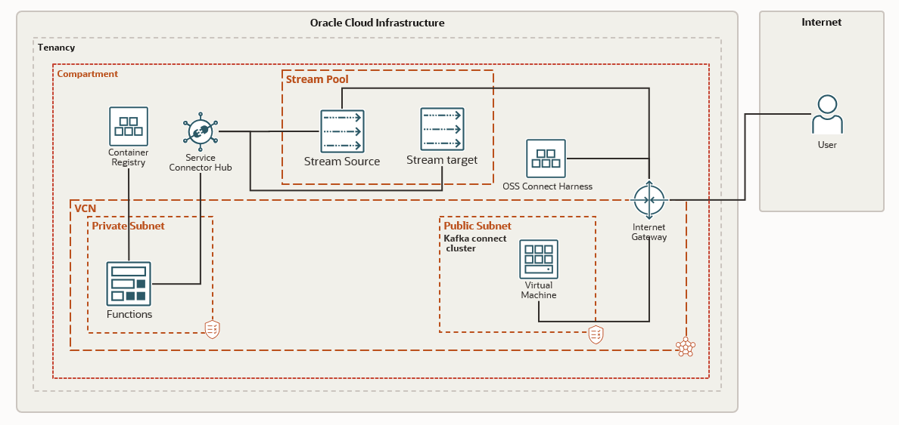

# oci-oss-serverless-processing

Quickstart demonstrating the serverless processing using OCI Streams, Service Connector hub, functions and AI language service. 
The solution publishes the stream of tweets from twitter using Kafka connector to OCI streams. The stream of tweets is processed using functions which call the AI service to recognize phrases in the tweets. The output of the AI service is placed in another output stream. Stream as a source, functions as a task and Streams as the target is configured in the SCH to orchestrate the flow.


## Prerequisites

- Permission to `manage` the following types of resources
    - VCNS, InternetGateways, RouteTables, Subnets
    - Compute Instances
    - Stream Pools
    - Streams
    - Connect Harness
    - Functions
    - AI language service

- Quota to create the above resources.

If you don't have the required permissions and quota, contact your tenancy administrator. See [Policy Reference](https://docs.cloud.oracle.com/en-us/iaas/Content/Identity/Reference/policyreference.htm), [Service Limits](https://docs.cloud.oracle.com/en-us/iaas/Content/General/Concepts/servicelimits.htm), [Compartment Quotas](https://docs.cloud.oracle.com/iaas/Content/General/Concepts/resourcequotas.htm).

## Deploy Using Oracle Resource Manager

1. Click [](https://cloud.oracle.com/resourcemanager/stacks/create?region=home&zipUrl=https://github.com/oracle-quickstart/oci-oss-serverless-processing/releases/latest/download/oci-oss-serverless-processing-latest.zip)

    If you aren't already signed in, when prompted, enter the tenancy and user credentials.

2. Review and accept the terms and conditions.

3. Select the region where you want to deploy the stack.

4. Follow the on-screen prompts and instructions to create the stack.

5. After creating the stack, click **Terraform Actions**, and select **Plan**.

6. Wait for the job to be completed, and review the plan.

    To make any changes, return to the Stack Details page, click **Edit Stack**, and make the required changes. Then, run the **Plan** action again.

7. If no further changes are necessary, return to the Stack Details page, click **Terraform Actions**, and select **Apply**. 

## Deploy Using the Terraform CLI

### Clone the Module
Now, you'll want a local copy of this repo. You can make that with the commands:

    git clone https://github.com/oracle-quickstart/oci-oss-serverless-processing.git
    cd oci-oss-serverless-processing
    ls

### Set Up and Configure Terraform

1. Complete the prerequisites described [here](https://github.com/cloud-partners/oci-prerequisites).

2. Create a `terraform.tfvars` file, and specify the following variables:

```
# Authentication
tenancy_ocid         = "<tenancy_ocid>"
current_user_ocid    = "<user_ocid>"
fingerprint          = "<finger_print>"
private_key_path     = "<pem_private_key_path>"

# Region
region = "<oci_region>"

# Compartment
compartment_ocid = "<compartment_ocid>"

# OCIR credentials
ocir_user_name = "<user_name>"
ocir_user_password = "<auth_code of the user>"

# twitter credentials
twitter_oauth_accessToken       = "<access-token>"
twitter_oauth_accessTokenSecret = "<access-token secret>"
twitter_oauth_consumerKey       = "<consumer-key>"
twitter_oauth_consumerSecret    = "<consumer-secret>"

````

### Create the Resources
Run the following commands:

    terraform init
    terraform plan
    terraform apply

### Destroy the Deployment
When you no longer need the deployment, you can run this command to destroy the resources:

    terraform destroy

## Post Deployment
Once the resources are deployed either through CLI or through resource manager run the following commands on the instance. (Use the private key generated to login to the instance)
- Start the kafka connect. Configuration file has allready been created as part of deployment.
- Call the rest endpoint to configure the twitter connector. Configuration for connector copied as part of the stack.

```
nohup ./kafka/bin/connect-distributed.sh connect-distributed.properties >> connect.logs &
curl -i -X POST -H "Accept:application/json" -H "Content-Type:application/json" localhost:8083/connectors/ -d @twitter_connector.json
````

## Quick Start Architecture 



